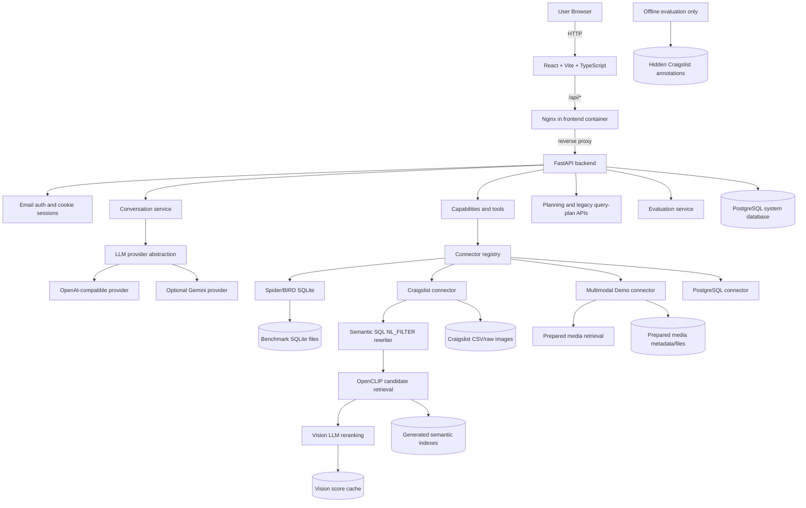
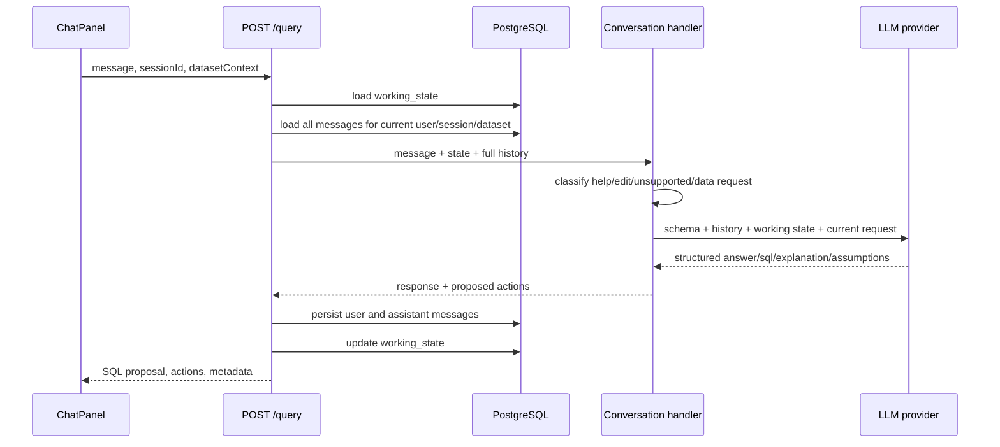

# DebugSQL Engineering Handbook

**Project name:** DebugSQL: A Chat-Driven, Approval-Gated Assistant for Multimodal Data Exploration  
**Repository:** `git@github.com:jie-wang-jw/debugsql.git`  
**Primary deployment branch:** `main`  
**Last handbook review:** July 31, 2026

This handbook describes the current implementation of DebugSQL. It is intended for developers, operators, evaluators, and future team members who need to understand, run, deploy, troubleshoot, or extend the system.

The handbook documents the code that exists in the repository. It deliberately separates verified behavior from prototype behavior. Craigslist image retrieval now uses embeddings generated from raw JPEG bytes and a vision-LLM reranker. The prepared benchmark labels are evaluation-only and are not available to the runtime query path. Audio and video remain metadata/transcript-based prototype capabilities.

## Contents

- [1-3: Purpose, maturity, and architecture](#1-project-purpose)
- [4-9: Repository, backend, connectors, benchmarks, and semantic SQL](#4-repository-layout)
- [10-13: Frontend, authentication, persistence, and APIs](#10-frontend-architecture)
- [14-18: Local development, testing, deployment, configuration, and troubleshooting](#14-local-development)
- [19-22: Evaluation, extensions, security, and releases](#19-evaluation-and-research-metrics)
- [23-25: Team workflow, commands, and definition of done](#23-team-development-rules)

---

## 1. Project Purpose

DebugSQL is a browser-based data assistant. A user selects a prepared dataset, asks a natural-language question, reviews generated read-only SQL, and explicitly approves execution. The system returns tabular results and, for supported datasets, linked media previews.

The project currently supports four dataset families:

1. **Spider** relational SQLite databases.
2. **BIRD** relational SQLite databases.
3. **Craigslist Furniture**, combining structured furniture records and prepared listing images.
4. **Multimodal Demo**, combining structured entities with prepared image, audio, and video metadata.

The main user workflow is:

```text
Select dataset
    -> Ask a natural-language question
    -> LLM proposes read-only SQL or a clarification
    -> User validates SQL
    -> User explicitly approves execution
    -> Backend executes against the selected connector
    -> UI displays rows, metrics, and media previews
    -> Conversation, execution, and audit records are persisted
```

The current default UI is **chat-first**. The Query Plan and Inspector subsystem still exists in the codebase and API, but it is not the primary user workflow.

---

## 2. Current Scope and Maturity

### 2.1 Implemented

- React/Vite/TypeScript browser application.
- FastAPI backend.
- PostgreSQL system database in Docker.
- SQLite benchmark execution for Spider and BIRD.
- Email verification-code login and cookie sessions.
- Development auto-login mode.
- Current-user conversation history.
- Read-only administrator view of all users' histories.
- Full persisted conversation history sent to the configured LLM for the current session.
- Structured `working_state` for multi-turn SQL refinement.
- OpenAI-compatible LLM provider abstraction.
- Optional Google Gemini provider.
- SQL validation and explicit execution approval.
- Persistent messages, executions, query plans, edits, repair cases, and operation logs.
- Capability-aware benchmark registry.
- Semantic SQL with `NL_FILTER(...)`, structured filters, joins, multiple predicates, aggregates, ordering, and limits.
- Leakage-free Craigslist relational-plus-image queries using OpenCLIP retrieval and vision-LLM reranking over raw images.
- Offline Craigslist image and title index builder with persistent model/index caches.
- Prepared image/audio/video metadata and previews in Multimodal Demo.
- Evaluation and repair-case API infrastructure.
- Docker Compose deployment.

### 2.2 Prototype-Level or Partial

- Multimodal Demo includes prepared media, but video is displayed through its preview asset and audio primarily through transcript metadata. It is not a full media-analysis pipeline.
- Craigslist image retrieval is operational, but its quality and latency depend on the OpenCLIP model, the configured vision provider/model, candidate counts, and calibrated score policy.
- PostgreSQL is fully used as the system database. The user-facing arbitrary PostgreSQL data connector exists as an extension point and should be tested before presenting it as a complete data-source feature.
- Query Plan, Inspector editing, plan-node merging, step runs, and evaluation endpoints remain available, but the current main UI emphasizes Chat, Capabilities, and Execution.
- Formal first-pass evaluation has been completed on 50-question Spider and BIRD subsets. DRR, EI, schema-linking correction, and time-to-correct still require controlled repair experiments.
- Full conversation history and structured working state are sent only for the authenticated user's current session and dataset. Dataset changes reset the active context.

### 2.3 Out of Current Scope

- User-uploaded media.
- Untrusted arbitrary database connections.
- Write queries or database modifications.
- Full ThalamusDB approximate query processing.
- Full multimodal benchmark evaluation at production scale.
- Distributed execution.
- Guaranteed SQL correctness from an LLM.
- High-availability production deployment.

---

## 3. High-Level Architecture



### 3.1 Runtime Services

`docker-compose.yml` defines three services:

| Service | Technology | Purpose | Public exposure |
|---|---|---|---|
| `postgres` | PostgreSQL 16 Alpine | Users, sessions, history, logs, plans, execution previews, evaluation records | Bound to `127.0.0.1` only |
| `backend` | Python 3.11, FastAPI, Uvicorn | Auth, LLM calls, SQL policy, connectors, execution, persistence | Internal Docker network only |
| `frontend` | Nginx serving a Vite build | Browser UI and `/api/` reverse proxy | Host port 80 or configured `FRONTEND_PORT` |

Only the frontend should normally be exposed publicly. The backend and PostgreSQL communicate on the Docker network.

### 3.2 Storage Boundaries

The project uses two distinct data categories:

1. **System data:** PostgreSQL stores users, sessions, conversations, messages, execution previews, logs, and evaluation records.
2. **Query data:** Spider/BIRD SQLite files, Craigslist assets, and multimodal assets are mounted read-only into the backend container.

This separation is intentional. Benchmark data should not be stored inside PostgreSQL, and user/audit data should not be written into benchmark SQLite databases.

---

## 4. Repository Layout

```text
debugsql/
|-- backend/
|   |-- app/
|   |   |-- benchmarks/       Unified benchmark descriptors/providers
|   |   |-- conversation/     Intent classification and NL-to-SQL flow
|   |   |-- craigslist/       Craigslist registry, resolver, preview route
|   |   |-- gemini/           Shared LLM schemas, prompts, Gemini/OpenAI-compatible clients
|   |   |-- models/           SQLAlchemy system-database models
|   |   |-- multimodal/       Prepared media registry, retrieval, planning, routes
|   |   |-- nl2ir/            Legacy/provider boundary for NL-to-IR
|   |   |-- planning/         IR-to-plan provider boundary
|   |   |-- semantic_sql/     NL_FILTER parser, resolver contracts, SQL rewriter
|   |   |-- semantic_index/   Offline OpenCLIP/MiniLM index builder and stores
|   |   |-- tools/            Capabilities, connectors, SQL policy, execution
|   |   |-- auth_routes.py
|   |   |-- benchmark_routes.py
|   |   |-- chat_routes.py
|   |   |-- evaluation_routes.py
|   |   |-- execution_routes.py
|   |   |-- history_routes.py
|   |   |-- persistence.py
|   |   |-- query_plan_routes.py
|   |   `-- main.py
|   |-- alembic/              Database migrations
|   |-- tests/                Backend tests
|   |-- Dockerfile
|   |-- pyproject.toml
|   `-- requirements.txt
|-- frontend/
|   |-- src/
|   |   |-- components/
|   |   |   |-- auth/
|   |   |   |-- capabilities/
|   |   |   |-- chat/
|   |   |   |-- inspector/        Secondary/legacy plan UI
|   |   |   |-- layout/
|   |   |   |-- query-plan/       Secondary/legacy plan UI
|   |   |   `-- results/
|   |   |-- pages/
|   |   |-- services/
|   |   |-- store/
|   |   `-- types/
|   |-- Dockerfile
|   |-- nginx.conf
|   `-- package.json
|-- data/
|   |-- benchmarks/
|   |   |-- spider/
|   |   |-- bird/
|   |   `-- Craigslist/
|   |-- multimodal_demo/
|   |-- indexes/              Generated semantic indexes; ignored by Git
|   |-- model-cache/          Downloaded model weights; ignored by Git
|   |-- evaluation/           Hidden annotations/results; not mounted at runtime
|   `-- postgres/             Docker bind-mounted PostgreSQL data
|-- docs/
|-- scripts/
|-- docker-compose.yml
|-- .env.example
|-- .env.server.example
`-- README.md
```

Developer-specific AI helper directories may exist locally. They are not runtime dependencies and should not be included in ordinary project commits unless the team explicitly decides otherwise.

---

## 5. Backend Architecture

### 5.1 Application Entry Point

`backend/app/main.py`:

- configures timestamped logging;
- loads settings;
- logs LLM provider startup status;
- creates the FastAPI application;
- configures CORS;
- registers auth, benchmark, capabilities, chat, planning, query-plan, execution, history, evaluation, Craigslist, and multimodal routes;
- exposes `/health`, `/db-health`, and `/hello`.

Health endpoints:

```text
GET /health
GET /db-health
GET /hello
```

`/health` reports the configured provider names and whether Gemini/OpenAI-compatible credentials are present. It does not guarantee that an external LLM request will succeed. A live provider call is still required for end-to-end verification.

### 5.2 Configuration

`backend/app/config.py` uses `pydantic-settings`. It searches for `.env` in:

1. repository root;
2. backend root;
3. current working directory.

Settings are cached. After changing `.env`, restart or recreate the backend process/container.

Important provider settings:

```env
QUERY_PLAN_PROVIDER=openai_compatible
LLM_API_BASE_URL=https://provider.example/v1
LLM_API_KEY=replace_me
LLM_MODEL=replace_me
LLM_TIMEOUT_SECONDS=30
```

The name `QUERY_PLAN_PROVIDER` is historical. In the chat-first architecture it selects the LLM used to produce the answer-first structured SQL proposal.

Supported values:

- `openai_compatible`
- `gemini`
- an unsupported value, which disables the active LLM path and leaves only limited fallbacks

### 5.3 Request Authentication

Authenticated routes call helpers in `backend/app/request_auth.py`:

- `request_user_id()` resolves the current cookie session.
- `request_current_user()` returns the full user object.
- `request_admin_user()` additionally requires `is_admin=true`.

Frontend requests use `credentials: 'include'`, so the `debugsql_session` cookie is automatically sent.

### 5.4 Chat Request Flow



`backend/app/chat_routes.py` owns database interaction for chat. `handle_chat_message()` remains a service function and does not open a database session.

The request body is:

```json
{
  "message": "Show the top 10 authors",
  "sessionId": "session-...",
  "datasetContext": {
    "dbType": "sqlite_benchmark",
    "benchmark": "spider",
    "dbId": "academic"
  }
}
```

The response may include:

- assistant `content`;
- proposed `sql`;
- explanation and confidence;
- assumptions and tables used;
- proposed tool actions;
- `usedContext` and `conversationMode`;
- multimodal matches and predicates;
- working-state revision.

### 5.5 Multi-Turn Context

Multi-turn behavior uses two complementary inputs:

1. **Full conversation history:** all persisted user and assistant messages for the authenticated user's current `sessionId`, ordered oldest to newest.
2. **Working state:** a structured JSON summary of the active query, including SQL, explanation, assumptions, dataset context, execution summary, and revision.

The LLM receives both. The working state gives a clean machine-readable query state; the message history preserves conversational intent.

Context isolation rules:

- only the authenticated user's current conversation is loaded;
- admin/all-user history is never used as LLM context;
- another session is not included;
- changing benchmark/database invalidates old context before the LLM call;
- the current unsaved user request is appended separately by the prompt builder.

The frontend `New` action generates a new session id and starts fresh context. Restoring a conversation from History restores the session id, allowing follow-up refinement.

### 5.6 Intent Classification

`backend/app/conversation/intent_classifier.py` performs a coarse first pass. It recognizes help, unsupported requests, and legacy plan-edit language. Data requests then proceed to `build_proposed_actions()`.

The LLM response determines the final conversational mode:

- `new_query`
- `refine_query`
- `schema_answer`
- `clarify`

Rule-based classification should not be treated as a semantic parser. It is only a routing safeguard.

### 5.7 SQL Resolution Priority

`backend/app/conversation/sql_resolver.py` uses this priority:

1. configured LLM provider;
2. benchmark gold-SQL exact/known-question lookup;
3. limited schema-aware fallback for simple non-Craigslist questions;
4. clarification/no SQL.

Craigslist deliberately does not use the simple single-table fallback. If the LLM fails to create semantic SQL, the system returns no SQL instead of silently changing the meaning of the request.

For a follow-up with a working state, reliable refinement requires an active LLM provider. If the provider is unavailable, the system asks the user to restate the complete query rather than pretending to understand context.

### 5.8 LLM Contract

The shared provider response is an answer-first structured object containing fields such as:

```json
{
  "can_answer": true,
  "mode": "new_query",
  "answer": "I prepared a query that will answer this after execution.",
  "sql": "SELECT ...",
  "explanation": "Why these tables and joins were selected",
  "assumptions": [],
  "tables_used": ["author"],
  "confidence": 0.9,
  "clarifying_question": null
}
```

Before execution, the assistant should describe the proposed query, not claim an unverified factual result. The actual answer is summarized only after approved SQL execution.

### 5.9 LLM Providers

#### OpenAI-Compatible

`backend/app/gemini/openai_compatible_service.py` uses the OpenAI Python client with configurable `base_url`, API key, model, and timeout. This supports GoAPI and other compatible gateways without provider-specific source changes.

GoAPI example:

```env
QUERY_PLAN_PROVIDER=openai_compatible
LLM_API_BASE_URL=https://goapi.gptnb.ai/v1
LLM_API_KEY=replace_with_a_rotated_secret
LLM_MODEL=provider-supported-model
LLM_TIMEOUT_SECONDS=30
GEMINI_API_KEY=
```

The final report used GPT-4.1 through GoAPI for relational SQL generation.
This is a deployment choice, not a hard dependency: the application remains
provider-neutral and can use another OpenAI-compatible endpoint by changing
the base URL, API key, and model.

Alibaba Cloud Model Studio example:

```env
QUERY_PLAN_PROVIDER=openai_compatible
LLM_API_BASE_URL=https://your-workspace.example/compatible-mode/v1
LLM_API_KEY=replace_me
LLM_MODEL=qwen-plus
```

Do not define `QUERY_PLAN_PROVIDER` twice in the same `.env`; the later value may override the intended provider.

#### Gemini

```env
QUERY_PLAN_PROVIDER=gemini
GEMINI_API_KEY=replace_me
GEMINI_MODEL=gemini-2.0-flash
GEMINI_TIMEOUT_SECONDS=30
```

Network access to Google APIs may be unavailable from some hosting regions. Test from inside the backend container before relying on Gemini in a demonstration.

### 5.10 Provider Failure Behavior

Expected failure classes include:

- missing API key/base URL;
- timeout;
- quota exhaustion or HTTP 403;
- unsupported model;
- invalid JSON;
- schema validation failure;
- answer marked possible but SQL missing.

The backend logs provider, model, request start, parse status, and failure details. It must not log API keys.

---

## 6. Capability and Tool System

### 6.1 Capabilities Explorer

The frontend Capabilities drawer calls:

```text
GET /capabilities?dbType=...&benchmark=...&dbId=...
```

The backend returns:

- database type and selected scope;
- available tables and columns;
- relationships;
- supported tools;
- read-only limits;
- benchmark capabilities;
- example prompts or SQL.

The drawer is intentionally secondary. It is opened from the `Capabilities` button in the Execution header instead of occupying the main workspace continuously.

### 6.2 Tool Catalog

`backend/app/tools/executor.py` defines:

| Tool | Approval | Purpose |
|---|---:|---|
| `introspect_schema` | No | Return tables, columns, relationships |
| `list_tables` | No | List tables |
| `describe_table` | No | Describe one table |
| `sample_rows` | No | Return a limited sample |
| `get_relationships` | No | Return foreign-key style relationships |
| `explain_sql` | No | Run explain when supported |
| `run_sql_preview` | No | Validate read-only SQL without executing |
| `run_sql` | Yes | Execute approved read-only SQL |

### 6.3 Approval Boundary

The chat response proposes actions. Validation can run immediately, but `run_sql` returns an error unless `approved=true` is sent. This check is in the backend, not only in the UI.

### 6.4 SQL Safety Policy

`backend/app/tools/policy.py` accepts only one read-only statement:

- query must begin with `SELECT` or `WITH`;
- empty SQL is rejected;
- comments are rejected;
- stacked statements are rejected;
- dangerous keywords such as `INSERT`, `UPDATE`, `DELETE`, `DROP`, `ATTACH`, `PRAGMA`, and `VACUUM` are rejected.

This is a safety layer, not a formal proof of harmlessness. Benchmark databases are also mounted read-only in Docker.

---

## 7. Connector Architecture

`backend/app/tools/registry.py` maps `DatasetContext.dbType` to a connector:

```text
sqlite_benchmark -> BenchmarkSQLiteConnector
postgres         -> PostgresConnector
multimodal_demo  -> MultimodalDemoConnector
craigslist       -> CraigslistConnector
```

Each connector follows the interface in `backend/app/tools/connector_base.py` and is responsible for:

- capabilities;
- schema introspection;
- table listing/description;
- sample rows;
- relationships;
- SQL validation;
- read-only execution;
- optional explain support.

### Adding a Connector

1. Implement `DatabaseConnector`.
2. Add it to `_CONNECTORS` in `tools/registry.py`.
3. Add a matching `dbType` to frontend API types.
4. Add a benchmark descriptor/provider if it is selectable as a benchmark.
5. Add capabilities tests.
6. Add SQL-policy tests.
7. Add an end-to-end query, validation, execution, and history test.

---

## 8. Benchmark Architecture

### 8.1 Unified Descriptor

`backend/app/benchmarks/descriptor.py` defines a capability-aware benchmark descriptor:

```text
id
label
status: ready | missing | partial
connector
modalities
capabilities
databaseCount
description
extra
```

Capabilities include:

- `structured_sql`
- `cross_table_join`
- `image_semantic_predicate`
- `audio_semantic_predicate`
- `video_semantic_predicate`
- `ai_fuzzy_match`

### 8.2 Registered Providers

`backend/app/benchmarks/registry.py` currently registers:

- `RelationalBenchmarkProvider` for Spider/BIRD;
- `MultimodalBenchmarkProvider`;
- `CraigslistBenchmarkProvider`.

The registry feeds both the left-side selector and Capabilities Explorer. Dataset status should reflect the files actually available to the backend.

### 8.3 Spider

Typical layout:

```text
data/benchmarks/spider/
|-- clean_schema.json
|-- clean_dev.json
`-- sqlite/
    `-- academic/
        `-- academic.sqlite
```

Use `scripts/clean_spider.py` to prepare metadata. The exact downloaded archive layout may differ, so inspect the script's expected inputs before running it.

### 8.4 BIRD

Typical layout:

```text
data/benchmarks/bird/
|-- clean_schema.json
|-- clean_dev.json
`-- sqlite/
    `-- card_games/
        `-- card_games.sqlite
```

Use `scripts/clean_bird.py` for metadata preparation.

### 8.5 Craigslist Furniture

Required layout:

```text
data/benchmarks/Craigslist/
|-- furnitures.csv
|-- imgs.csv
|-- queries.sql
`-- furniture_imgs/
```

The runtime reads only the two CSV files, raw images, and permitted query examples. The connector builds an in-memory/queryable SQLite representation from those inputs. Image previews are authorized through `imgs.csv` and served through an asset-validated route, never an arbitrary filesystem path.

Hidden benchmark annotations must be stored outside the runtime mount:

```text
data/evaluation/craigslist/
|-- craigslist_imgs_label.json
`-- craigslist_furnitures_title_label.json
```

The runtime semantic path must not read these files. Image vectors are generated from raw JPEG bytes with OpenCLIP. Title vectors are generated from original listing titles with MiniLM. Hidden annotations are loaded only by explicit evaluation commands after retrieval and SQL execution.

Generated runtime artifacts:

```text
data/indexes/craigslist/
|-- image_embeddings.npy
|-- image_ids.json
|-- title_embeddings.npy
|-- title_ids.json
|-- manifest.json
`-- vision_scores.sqlite
```

See [Craigslist Multimodal Benchmark](CRAIGSLIST_BENCHMARK.md) for indexing, offline deployment, and evaluation commands.

### 8.6 Multimodal Demo

Required layout:

```text
data/multimodal_demo/
|-- metadata/
|   |-- entities.json
|   `-- assets.json
`-- media/
    |-- images/
    |-- audio/
    `-- video/
```

Each media asset contains:

- asset id;
- entity id;
- media type;
- relative file path;
- caption and/or transcript;
- tags;
- extra metadata.

The backend resolves asset paths under the configured root and rejects path traversal.

### 8.7 Adding a Benchmark

1. Define how data is downloaded and licensed.
2. Keep large/raw data out of Git when appropriate.
3. Create a deterministic local directory layout.
4. Implement a `BenchmarkProvider` descriptor and database list.
5. Reuse an existing connector or implement a new one.
6. Add sample questions that are known to return meaningful results.
7. Add capability labels that match actual behavior.
8. Test missing, partial, and ready states.
9. Test switching away from and back to the dataset in the UI.
10. Add evaluation metadata and gold answers where available.

---

## 9. Semantic SQL and `NL_FILTER`

### 9.1 Purpose

`NL_FILTER(column, 'natural-language predicate')` represents a semantic condition that ordinary SQLite cannot evaluate directly.

Example:

```sql
SELECT f.aid, f.title, f.price, i.img AS asset_id
FROM furniture AS f
JOIN images AS i ON i.aid = f.aid
WHERE NL_FILTER(f.title_u, 'wooden table')
  AND NL_FILTER(i.img, 'table photo')
ORDER BY nlf_0_score DESC, nlf_1_score DESC
LIMIT 20;
```

### 9.2 Rewrite Process

`backend/app/semantic_sql/rewriter.py`:

1. parses SQL with `sqlglot`;
2. extracts every `NL_FILTER` operator;
3. validates that the referenced table/column supports semantic resolution;
4. asks the selected semantic resolver for `(match_key, score)` pairs;
5. replaces `NL_FILTER` with true;
6. injects `VALUES` CTEs containing matches;
7. joins CTE matches to the semantic table primary key;
8. exposes `asset_id`, `score`, and per-operator score columns;
9. validates rewritten SQL with the read-only policy;
10. executes ordinary SQLite SQL.

Conceptually:

```sql
WITH nlf_0(match_key, score) AS (
  VALUES ('asset-1', 0.92), ('asset-2', 0.81)
)
SELECT ..., nlf_0.score AS nlf_0_score
FROM media_assets
JOIN nlf_0 ON nlf_0.match_key = media_assets.id;
```

### 9.3 Multiple Predicates

Each predicate receives a stable operation id such as `nlf_0`, `nlf_1`, and a score column. The rewriter resolves predicates independently and uses score CTEs plus membership expressions so the original SQL Boolean structure is preserved. `AND`, `OR`, structured filters, joins, aggregates, ordering, and limits remain SQL concerns after semantic resolution.

### 9.4 Current Resolver

Craigslist uses a leakage-free two-stage resolver:

1. OpenCLIP encodes the natural-language image predicate.
2. Cosine similarity searches the complete normalized image embedding matrix.
3. The top `CLIP_CANDIDATE_COUNT` candidates are retained.
4. The top `VISION_RERANK_COUNT` raw images are resized and sent as base64 image data to the configured vision-capable OpenAI-compatible model.
5. The final score is `0.35 * CLIP + 0.65 * VLM`.
6. Vision scores are cached by dataset, image checksum, normalized predicate, provider, and model.

The VLM prompt uses short request-local candidate tokens and maps them back to real image IDs after strict response validation. This avoids failures caused by long path-like IDs while still rejecting missing, duplicate, unknown, or invalid scores.

The title resolver uses MiniLM embeddings generated only from original listing titles. Neither resolver reads hidden benchmark labels.

If the vision provider is unavailable, benchmark mode fails clearly. CLIP-only behavior is allowed only when `VISION_ALLOW_CLIP_ONLY=true`, and must be reported as a separate baseline.

### 9.5 Audio and Video Extension

Preserve the `SemanticResolver` contract and SQL rewrite layer. Add modality-specific indexers/resolvers rather than changing the SQL interface.

For audio/video:

- audio: ASR transcript embeddings plus optional audio embeddings;
- video: sampled frame embeddings plus ASR transcript and temporal metadata;
- aggregate asset-level scores from segments;
- preserve timestamps in preview metadata.

---

## 10. Frontend Architecture

### 10.1 Main Composition

`frontend/src/components/layout/AppShell.tsx` renders:

- left: `ChatPanel`;
- right: `ExecutionPanel`;
- secondary right drawer: `CapabilitiesPanel`.

Providers:

- `DatasetProvider` owns selected `dbType`, benchmark, and database;
- `ExecutionProvider` owns execution status and result;
- authentication is handled by `AuthGate` above the application route.

### 10.2 Chat Panel

`ChatPanel` owns:

- current messages;
- current session id;
- benchmark/database selector;
- recent history summaries;
- loading restored conversations;
- proposed actions;
- execution follow-up messages.

History loads the most recent 20 conversations. Older conversations remain in the database and can be exposed through pagination later.

### 10.3 Dataset State

`DatasetContext` normalizes special benchmark families:

- Spider/BIRD -> `sqlite_benchmark`
- Craigslist -> `craigslist`
- Multimodal Demo -> `multimodal_demo`

When switching from a fixed media dataset back to Spider/BIRD, state must reset both `dbType` and `dbId`. Any future selector change must be tested in both directions.

### 10.4 Proposed Actions

`ProposedActions` sends tool calls to `/tools/execute` and tracks action results. For `run_sql`, it requires user approval and forwards rows/metrics/media previews into `ExecutionContext`.

After successful execution, the backend may return `assistantFollowup`. The frontend uses it; otherwise it falls back to a deterministic local summary. It must not append duplicate summaries.

### 10.5 Execution Panel

The execution panel supports:

- idle/running/success/failed states;
- re-run of the last SQL;
- execution metrics;
- generated SQL, collapsed by default through `SQLPreview`;
- result table;
- media preview cards.

Current media rendering behavior:

- image: image thumbnail;
- video: preview image/asset in the current component, not a complete video player;
- audio: transcript-oriented placeholder, not a full audio player.

Do not claim complete audio/video playback until dedicated `<audio>` and `<video>` controls are implemented and tested with browser-compatible MIME types.

### 10.6 Admin History

Administrators see `All History` in the user strip and can open `/admin/history`. The page is read-only and loads conversations from all users. Access is enforced by the backend `is_admin` check.

---

## 11. Authentication and Authorization

### 11.1 Development Auto-Login

```env
DEBUGSQL_AUTO_LOGIN=1
```

This creates/uses a development user. Use it only for local or private development.

### 11.2 Email Verification Login

Production/demo mode:

```env
DEBUGSQL_AUTO_LOGIN=0
EMAIL_DEV_LOG_CODES=0
SMTP_HOST=smtp.example.com
SMTP_PORT=465
SMTP_USERNAME=no-reply@example.com
SMTP_PASSWORD=<smtp_authorization_code>
SMTP_FROM=DebugSQL <no-reply@example.com>
SMTP_USE_TLS=0
SMTP_USE_SSL=1
```

Flow:

1. `POST /auth/email/request-code`
2. backend normalizes email and applies resend cooldown;
3. backend generates a six-digit code;
4. only a hash is stored;
5. email sender sends the code;
6. `POST /auth/email/verify-code`
7. backend checks expiry, attempts, and constant-time hash comparison;
8. user and session record are created/reused;
9. HTTP-only cookie is set.

Codes expire and have a maximum attempt count. OAuth routes return HTTP 410 and are intentionally disabled.

### 11.3 Cookie Settings

For an HTTP IP-based demo:

```env
AUTH_COOKIE_SECURE=false
```

For HTTPS production:

```env
AUTH_COOKIE_SECURE=true
```

The cookie is HTTP-only, `SameSite=Lax`, path `/`, and currently has a seven-day max age.

### 11.4 Administrator Assignment

Administrators are assigned manually in PostgreSQL:

```sql
UPDATE users
SET is_admin = true
WHERE email = 'administrator@example.com';
```

The user must log in once before the row exists. Verify:

```sql
SELECT email, is_admin FROM users ORDER BY email;
```

There is no general role/permission model; `is_admin` is the only elevated role.

---

## 12. Persistence Model

### 12.1 Tables

| Table | Purpose |
|---|---|
| `users` | Identity, display data, admin flag |
| `oauth_accounts` | Retained compatibility table; OAuth routes are disabled |
| `sessions` | Hashed session tokens and status |
| `email_login_codes` | Hashed verification codes, expiry, attempts |
| `conversations` | User/session conversation, dataset context, working state |
| `messages` | User/assistant messages and response metadata |
| `query_plans` | Persisted IR, graph, SQL, provider metadata |
| `plan_edits` | Old/new node payload and edit result |
| `execution_runs` | SQL/run state, preview, metrics, errors |
| `repair_cases` | Controlled repair experiments and metrics |
| `operation_logs` | Audit events |

### 12.2 Persistence Strategy

The code uses database-first persistence with some in-memory compatibility stores for active plan/run behavior. Retrieval methods generally prefer current memory state and can restore durable state from PostgreSQL.

Execution results persist a preview, not an unlimited result set. Large-result support should use pagination, cursors, or object storage rather than expanding a JSON column indefinitely.

### 12.3 Migrations

Migrations live in `backend/alembic/versions/`:

```text
20260521_0001_core_persistence.py
20260525_0002_email_login_codes.py
20260601_0003_node_previews_repair_cases.py
20260608_0004_user_admin_flag.py
20260624_0005_conversation_working_state.py
```

Always run:

```bash
docker compose exec backend alembic upgrade head
```

after deploying code containing migrations.

---

## 13. API Reference

All normal application endpoints require an authenticated cookie unless explicitly noted.

### System

```text
GET  /health
GET  /db-health
GET  /hello
```

### Authentication

```text
GET  /auth/me
POST /auth/logout
POST /auth/email/request-code
POST /auth/email/verify-code
```

OAuth compatibility routes return 410.

### Benchmarks and Capabilities

```text
GET  /benchmarks
GET  /benchmarks/{benchmark}/databases
GET  /capabilities
POST /tools/execute
```

### Chat

```text
POST /query
```

### History

```text
GET /history/summary?limit=20&offset=0
GET /history/conversations/{conversation_id}
GET /history/operation-logs/export?format=csv|json
```

### Admin

```text
GET /admin/history/summary?limit=20&offset=0
GET /admin/history/conversations/{conversation_id}
```

### Execution

```text
POST   /execute
GET    /execute/{run_id}/result
DELETE /execute/{run_id}
```

The chat-first UI primarily executes through `/tools/execute`; these routes support the plan-oriented subsystem.

### Planning and Query Plans

```text
POST  /planning/generate
GET   /query-plan/{plan_id}
PATCH /query-plan/{plan_id}/nodes/{node_id}
POST  /query-plan/{plan_id}/nodes/merge
POST  /query-plan/{plan_id}/snapshot
POST  /query-plan/{plan_id}/runs
GET   /query-plan/{plan_id}/runs/{run_id}
POST  /query-plan/{plan_id}/runs/{run_id}/step
POST  /query-plan/{plan_id}/runs/{run_id}/full
POST  /query-plan/{plan_id}/runs/{run_id}/reset
```

### Evaluation

```text
POST /evaluation/run
GET  /evaluation/runs/{run_id}
GET  /evaluation/runs/{run_id}/export
POST /evaluation/repair-cases
GET  /evaluation/repair-cases/{case_id}
GET  /evaluation/repair-summary
```

### Media

```text
GET /multimodal/datasets
GET /multimodal/assets/{asset_id}
GET /multimodal/assets/{asset_id}/preview
GET /craigslist/preview?img=...
```

---

## 14. Local Development

### 14.1 Prerequisites

- Git
- Docker Desktop with Compose, or local Python/Node/PostgreSQL
- Python 3.11 or 3.12
- Node.js 20+
- `uv` recommended

### 14.2 Clone

```bash
git clone git@github.com:jie-wang-jw/debugsql.git
cd debugsql
```

If SSH port 22 is blocked, configure GitHub SSH over port 443 or use HTTPS.

### 14.3 Environment

```powershell
Copy-Item .env.example .env
```

or:

```bash
cp .env.example .env
```

For local development, use:

```env
DEBUGSQL_AUTO_LOGIN=1
EMAIL_DEV_LOG_CODES=1
FRONTEND_PORT=5173
```

Add an LLM provider only when testing real NL-to-SQL behavior.

### 14.4 Docker Development

```bash
docker compose up -d --build
docker compose exec backend alembic upgrade head
docker compose ps
```

Open:

```text
http://127.0.0.1:5173/
```

Useful logs:

```bash
docker compose logs -f backend
docker compose logs -f frontend
docker compose logs -f postgres
```

Changing backend Python code requires rebuilding the backend image in this production-style Compose setup:

```bash
docker compose up -d --build backend
```

Changing frontend source requires rebuilding the static Vite/Nginx image:

```bash
docker compose up -d --build frontend
```

Restarting without `--build` does not include changed source code in an existing image.

#### Backend dependency installation

The backend image installs ordinary Python packages from the Alibaba Cloud PyPI mirror. CPU-only PyTorch is handled separately because the Alibaba PyTorch wheel directory is a flat file listing, not a PEP 503 package index. It therefore cannot resolve package names such as `torch==2.7.1+cpu` through `--index-url` or `--extra-index-url`.

The Dockerfile installs these pinned Linux x86-64/CPython 3.11 wheels by direct URL:

```text
torch 2.7.1+cpu
torchvision 0.22.1+cpu
```

The dependency layers are intentionally separated:

1. install `uv`;
2. install the CPU PyTorch wheels;
3. install ordinary application dependencies;
4. copy application source.

This keeps the approximately 168 MB PyTorch wheel cached when only application code or ordinary requirements change. Do not use `--no-cache` during routine builds.

To build and verify only the backend:

```bash
docker compose build --progress=plain backend
docker compose up -d backend
docker compose exec backend python -c "import torch, torchvision; print(torch.__version__, torchvision.__version__)"
```

The direct wheel URLs are specific to Linux x86-64 and CPython 3.11. An ARM server or a different Python version requires matching wheel URLs.

### 14.5 Local Backend Without Docker

Windows:

```powershell
cd backend
py -3.11 -m venv .venv
.\.venv\Scripts\Activate.ps1
python -m pip install uv
uv pip install -r requirements.txt
cd ..
.\scripts\start_backend.ps1
```

The PowerShell script uses local SQLite at `data/dev/debugsql.sqlite` unless `DATABASE_URL` is already set. It enables dev auto-login and applies Alembic migrations.

macOS/Linux:

```bash
cd backend
python3.11 -m venv .venv
source .venv/bin/activate
pip install uv
uv pip install -r requirements.txt
cd ..
./scripts/start_backend.sh
```

### 14.6 Local Frontend Without Docker

Windows:

```powershell
.\scripts\start_frontend.ps1
```

macOS/Linux:

```bash
./scripts/start_frontend.sh
```

The frontend development server proxies `/api` to `http://127.0.0.1:8000`.

---

## 15. Testing

### 15.1 Backend

```powershell
cd backend
.\.venv\Scripts\python.exe -m compileall app tests
.\.venv\Scripts\python.exe -m pytest
```

macOS/Linux:

```bash
cd backend
.venv/bin/python -m compileall app tests
.venv/bin/python -m pytest
```

### 15.2 Frontend

```bash
cd frontend
npm install
npm run build
```

The build performs TypeScript type checking and creates the Vite production bundle.

### 15.3 Required Smoke Test

Before merge/deployment:

1. login or use dev auto-login;
2. open Spider `academic`;
3. ask a schema question;
4. ask a data question;
5. validate SQL;
6. approve execution;
7. confirm result rows and execution summary;
8. ask a follow-up such as `top 5`;
9. confirm prior history and working SQL were used;
10. switch to BIRD and confirm old context is not reused;
11. switch to Craigslist and execute a known image example;
12. confirm image previews;
13. switch back to Spider;
14. logout/login and restore history;
15. as admin, open All History;
16. confirm a normal user cannot access admin routes.

### 15.4 Why Unit Tests Can Pass While a Demo Fails

Mocked tests verify internal contracts but cannot guarantee:

- external provider quota;
- provider model behavior;
- provider JSON consistency;
- network access from a cloud region;
- real benchmark files and paths;
- SMTP authentication;
- stale Docker images;
- browser cache or old static assets.

Always run both automated tests and a live provider/data smoke test.

---

## 16. Linux Server Deployment

### 16.1 Recommended Server Layout

```text
/data/debugsql/                 Git working tree
/data/debugsql/.env            Server secrets/config
/data/debugsql/data/postgres/  Persistent PostgreSQL bind mount
/data/debugsql/data/benchmarks/
/data/debugsql/data/multimodal_demo/
/data/debugsql/data/indexes/   Generated Craigslist semantic indexes
/data/debugsql/data/model-cache/ Offline OpenCLIP and MiniLM weights
```

### 16.2 First Deployment

```bash
cd /data
git clone git@github.com:jie-wang-jw/debugsql.git
cd debugsql
cp .env.server.example .env
vi .env
docker compose up -d --build
docker compose exec backend alembic upgrade head
docker compose ps
```

Craigslist also requires generated semantic indexes and the matching model cache. On a machine that can reach Hugging Face, build the indexes once:

```bash
docker compose exec backend \
  python -m app.semantic_index build --benchmark craigslist
```

For a server that cannot reach Hugging Face, build/download on another machine and copy a complete artifact archive. Before uploading it, verify that it contains all three categories:

```text
model-cache/huggingface/hub/models--laion--CLIP-ViT-B-32-laion2B-s34B-b79K/
model-cache/huggingface/hub/models--sentence-transformers--all-MiniLM-L6-v2/
indexes/craigslist/
```

Extract under the server data directory so the final paths are `/data/debugsql/data/model-cache/...` and `/data/debugsql/data/indexes/craigslist/...`:

```bash
cd /data/debugsql/data
tar -xzf /path/to/craigslist-runtime-artifacts-full.tar.gz
```

Set the offline environment variables shown in Section 17, then recreate the backend container. A restart alone does not apply a changed Compose mount or image:

```bash
cd /data/debugsql
docker compose up -d --force-recreate backend
docker compose exec backend python -c "import os; print(os.getenv('HF_HOME')); print(os.getenv('HF_HUB_OFFLINE'))"
```

Open:

```text
http://SERVER_IP/
```

The cloud security group needs inbound TCP 80. Do not expose PostgreSQL 5432 or backend 8000 publicly.

### 16.3 Updating

Use the deployment script:

```bash
bash scripts/deploy_server.sh /data/debugsql
```

It performs:

1. `git pull --ff-only`;
2. `docker compose up -d --build`;
3. `alembic upgrade head`.

Manual equivalent:

```bash
cd /data/debugsql
git pull --ff-only origin main
docker compose up -d --build
docker compose exec backend alembic upgrade head
```

For a frontend-only change, avoid rebuilding the backend and its machine-learning dependencies:

```bash
docker compose up -d --build frontend
```

For a backend source change, Docker should reuse the dependency layers:

```bash
docker compose build --progress=plain backend
docker compose up -d backend
docker compose exec backend alembic upgrade head
```

A first backend build downloads CPU PyTorch and other machine-learning packages and is substantially slower than later cached builds. Changes to `backend/Dockerfile`, `backend/requirements.txt`, `backend/pyproject.toml`, the base image, or a build with `--no-cache` can invalidate dependency layers.

### 16.4 Verifying the Deployed Commit

```bash
git rev-parse --short HEAD
docker compose images
docker compose ps
```

Confirm application health:

```bash
curl http://127.0.0.1/api/health
curl http://127.0.0.1/api/db-health
```

### 16.5 Persistent PostgreSQL Data

Compose mounts:

```text
./data/postgres:/var/lib/postgresql/data
```

Therefore `docker compose restart`, container recreation, and image rebuild do not remove database files. Do not run `docker compose down -v` unless intentionally deleting volumes, and do not delete `data/postgres/`.

### 16.6 Backup

Logical backup:

```bash
docker compose exec -T postgres pg_dump -U debugsql -d debugsql > debugsql-backup.sql
```

Restore into an empty/compatible database:

```bash
cat debugsql-backup.sql | docker compose exec -T postgres psql -U debugsql -d debugsql
```

Back up `.env` securely outside Git and separately back up benchmark/media data if it cannot be downloaded again.

### 16.7 Production Hardening

Before broader public use:

- use a domain and HTTPS;
- set `AUTH_COOKIE_SECURE=true`;
- rotate all secrets previously shared in chat/screenshots;
- use strong unique PostgreSQL, session, and SMTP secrets;
- restrict CORS to the real frontend origin;
- disable `DEBUGSQL_AUTO_LOGIN` and `EMAIL_DEV_LOG_CODES`;
- implement rate limiting for login-code requests and expensive LLM queries;
- add request-size limits;
- add structured centralized logs and alerts;
- add scheduled PostgreSQL backups;
- add resource limits and health checks;
- pin frontend dependency versions instead of `latest` where practical;
- review media licenses and privacy requirements.

---

## 17. Environment Variable Reference

### Database

| Variable | Meaning |
|---|---|
| `POSTGRES_DB` | Compose PostgreSQL database |
| `POSTGRES_USER` | Compose PostgreSQL user |
| `POSTGRES_PASSWORD` | PostgreSQL password |
| `POSTGRES_HOST_PORT` | Host loopback port |
| `DATABASE_URL` | SQLAlchemy system database URL |

### Authentication

| Variable | Meaning |
|---|---|
| `DEBUGSQL_AUTO_LOGIN` | Enable private dev auto-login |
| `DEBUGSQL_DEV_USER_EMAIL` | Dev user email |
| `DEBUGSQL_DEV_USER_NAME` | Dev display name |
| `SESSION_SECRET` | Session-related secret material |
| `AUTH_COOKIE_NAME` | Cookie name |
| `AUTH_COOKIE_SECURE` | Require HTTPS for cookie |
| `APP_BASE_URL` | Public backend base URL |
| `FRONTEND_BASE_URL` | Public frontend URL |

### Email

| Variable | Meaning |
|---|---|
| `EMAIL_LOGIN_CODE_TTL_MINUTES` | Code lifetime |
| `EMAIL_LOGIN_RESEND_SECONDS` | Resend cooldown |
| `EMAIL_LOGIN_MAX_ATTEMPTS` | Verification attempt limit |
| `EMAIL_DEV_LOG_CODES` | Log codes for development only |
| `SMTP_HOST`, `SMTP_PORT` | SMTP endpoint |
| `SMTP_USERNAME`, `SMTP_PASSWORD` | SMTP account/authorization code |
| `SMTP_FROM` | Sender header |
| `SMTP_USE_TLS`, `SMTP_USE_SSL` | Transport mode; do not enable both blindly |

### LLM

| Variable | Meaning |
|---|---|
| `QUERY_PLAN_PROVIDER` | `openai_compatible` or `gemini` |
| `LLM_API_BASE_URL` | Compatible API base ending in `/v1` as required |
| `LLM_API_KEY` | Provider secret |
| `LLM_MODEL` | Provider-supported model id |
| `LLM_TIMEOUT_SECONDS` | Request timeout |
| `GEMINI_API_KEY` | Gemini key |
| `GEMINI_MODEL` | Gemini model |
| `GEMINI_TIMEOUT_SECONDS` | Gemini timeout |

### Data

| Variable | Meaning |
|---|---|
| `BENCHMARK_HOST_DATA_DIR` | Host benchmark directory mounted by Compose |
| `BENCHMARK_DATA_DIR` | Container benchmark directory |
| `MULTIMODAL_HOST_DATA_DIR` | Host prepared media directory |
| `MULTIMODAL_DATA_DIR` | Container prepared media directory |
| `SEMANTIC_RESOLVER` | Craigslist resolver; benchmark runtime uses `clip_vlm` |
| `SEMANTIC_INDEX_HOST_DIR` | Host generated-index directory mounted by Compose |
| `SEMANTIC_INDEX_DIR` | Container generated-index directory |
| `MODEL_CACHE_HOST_DIR` | Host OpenCLIP/MiniLM cache directory mounted by Compose |
| `HF_HOME` | Container Hugging Face cache root |
| `HF_HUB_OFFLINE` | Set to `1` on offline servers after complete models are copied |
| `TRANSFORMERS_OFFLINE` | Set to `1` to prevent Transformer model network lookups |
| `CLIP_MODEL` | OpenCLIP architecture, currently `ViT-B-32` |
| `CLIP_PRETRAINED` | OpenCLIP checkpoint identity, currently `laion2b_s34b_b79k` |
| `TEXT_EMBEDDING_MODEL` | Title embedding model |
| `CLIP_CANDIDATE_COUNT` | Candidates retained by the first-stage image search |
| `VISION_PROVIDER` | Vision reranker provider type |
| `VISION_API_BASE_URL` | Vision provider OpenAI-compatible base URL |
| `VISION_API_KEY` | Vision provider secret |
| `VISION_MODEL` | Vision-capable model id |
| `VISION_RERANK_COUNT` | Number of CLIP candidates sent to the vision model |
| `VISION_TIMEOUT_SECONDS` | Vision request timeout |
| `VISION_ALLOW_CLIP_ONLY` | Explicitly allow a documented CLIP-only baseline |
| `SEMANTIC_SQL_SCORE_CUTOFF` | Minimum semantic membership score |
| `SEMANTIC_SQL_MAX_MATCHES` | Maximum semantic matches per predicate |

### Frontend

| Variable | Meaning |
|---|---|
| `FRONTEND_PORT` | Public host port |
| `VITE_API_BASE_URL` | Browser API prefix, normally `/api` |
| `VITE_DEV_API_TARGET` | Vite/Nginx development proxy target |
| `VITE_USE_MOCK_SERVICES` | Use frontend mock adapters when explicitly enabled |
| `VITE_SHOW_DEV_AUTH_NOTE` | Show local dev auth note |
| `CORS_ORIGINS` | Comma-separated backend origins |

---

## 18. Troubleshooting

### Frontend Shows an Old UI

Cause: restarting a container does not rebuild the static frontend image.

```bash
docker compose up -d --build frontend
```

Then hard-refresh the browser. Verify the image creation time with `docker compose images`.

### Backend Code Change Has No Effect

```bash
docker compose up -d --build backend
docker compose logs -f backend
```

### LLM Still Uses the Wrong Provider

Check duplicates and effective container values:

```bash
grep -nE 'QUERY_PLAN_PROVIDER|LLM_API_BASE_URL|LLM_MODEL|GEMINI' .env
docker compose exec backend python -c "import os; print(os.getenv('QUERY_PLAN_PROVIDER')); print(os.getenv('LLM_API_BASE_URL')); print(os.getenv('LLM_MODEL'))"
```

Do not print complete API keys.

Recreate backend after `.env` changes:

```bash
docker compose up -d --force-recreate backend
```

### LLM 403 / Insufficient Quota

The code is reaching the provider, but the account/model has no usable quota. Add billing/credit, disable free-tier-only mode if appropriate, or configure a different supported model/provider.

### LLM Timeout

Test network access from inside the backend container. A key being present does not prove connectivity. Some providers are inaccessible from some cloud regions.

### Provider Returns Invalid JSON

Inspect timestamped backend logs for parse/validation errors. Confirm the model supports JSON output reliably. Strengthen the prompt or use a more instruction-following model.

### Email Code Not Received

Check:

```bash
docker compose logs backend | grep -Ei 'smtp|login code|auth'
```

Common causes:

- using account password instead of SMTP authorization code;
- wrong SSL/TLS mode;
- outbound SMTP blocked;
- sender mismatch;
- spam filtering;
- resend cooldown.

### Verification Returns HTTP 500

Inspect the complete traceback. Run migrations and check for duplicate/legacy database rows:

```bash
docker compose exec backend alembic upgrade head
```

### PostgreSQL Password Authentication Failed

Changing `.env` does not change credentials inside an already initialized PostgreSQL data directory. Either restore the original password, alter the role password from PostgreSQL, or deliberately reinitialize after backing up data.

### `role postgres does not exist`

The Compose cluster is initialized with `POSTGRES_USER=debugsql`, so connect as that user:

```bash
docker compose exec postgres psql -U debugsql -d debugsql
```

### Benchmark Shows Missing or Zero Local Databases

Verify host path, container mount, filenames, and permissions:

```bash
ls -la data/benchmarks
docker compose exec backend ls -la /app/data/benchmarks
```

### SQLite `unable to open database file`

The database path likely exists only on the host or uses a Windows path inside Linux. The backend must use `BENCHMARK_DATA_DIR=/app/data/benchmarks`, and Compose must mount the host data into that path.

### Multimodal/Craigslist Query Returns Irrelevant Results

First separate SQL-generation quality from visual-retrieval quality. Inspect the generated `NL_FILTER` predicate, OpenCLIP/VLM model settings, candidate counts, returned scores, and the `vision_scores.sqlite` cache. Changing only the text-to-SQL model will not repair a poor visual predicate or a stale vision cache. Record CLIP-only and CLIP+VLM results separately.

### `NL_FILTER` Produces No Rows

Check each semantic predicate independently, then verify its score cutoff and key column. For `AND`, one empty membership set correctly makes the result empty; for `OR`, the rewriter should preserve either-side membership. Inspect `nlf_0_score`, `nlf_1_score`, rewritten SQL, index manifest, and resolver logs.

### OpenCLIP Tries to Reach Hugging Face on the Server

This means the complete model cache is absent, mounted at the wrong host path, or offline variables were not applied to the recreated backend container. Verify:

```bash
docker compose exec backend sh -lc 'echo "$HF_HOME $HF_HUB_OFFLINE $TRANSFORMERS_OFFLINE"'
docker compose exec backend sh -lc 'find /app/data/model-cache/huggingface/hub -name "open_clip_model.safetensors" -o -name "open_clip_pytorch_model.bin"'
docker compose exec backend ls -la /app/data/indexes/craigslist
```

The cache must contain the actual checkpoint file, not only model metadata. If the files exist only on the host, verify `MODEL_CACHE_HOST_DIR` and recreate the backend with `docker compose up -d --force-recreate backend`.

### `Vision response contains invalid or duplicate image IDs`

Update to a build containing the short candidate-token mapping in `backend/app/craigslist/vision.py`, rebuild the backend, and retry. The current implementation sends `candidate_1`, `candidate_2`, and so on to the provider, validates the returned token set, then maps scores back to real asset paths. If the error persists, inspect the raw provider response without logging image bytes or secrets.

### Benchmark Cannot Switch Back After Multimodal Selection

This is a frontend state-normalization issue. Verify `DatasetContext.setBenchmark()` and `setDbType()` reset special connector state to `sqlite_benchmark`, and rebuild the frontend. Add a two-way selector smoke test.

### GitHub SSH Port 22 Timeout

Use GitHub SSH over port 443 in `~/.ssh/config`:

```text
Host github.com
  Hostname ssh.github.com
  Port 443
  User git
```

Test:

```bash
ssh -T git@github.com
```

### Docker Build Is Slow on Alibaba Cloud

The Dockerfile uses the Alibaba Cloud PyPI mirror for ordinary packages and direct Alibaba-hosted URLs for the pinned CPU PyTorch wheels. A first backend build is still large because PyTorch and its machine-learning dependencies must be downloaded and installed.

Use a plain-progress backend-only build to see the active package and preserve its output:

```bash
docker compose build --progress=plain backend 2>&1 | tee backend-build.log
```

Practical rules:

- do not use `--no-cache` for routine deployment;
- build only `frontend` when only frontend files changed;
- keep Docker/BuildKit cache data between deployments;
- do not repeatedly switch package mirrors during an in-progress build;
- let a downloading layer finish unless network counters and logs remain unchanged for an extended period.

If a standalone `pip download` is fast but the image build is slow, inspect the verbose build log. The delay may be a large dependency, dependency resolution, extraction, or installation rather than the mirror itself.

### PyTorch Reports `No matching distribution` or `versions: none`

Do not configure this directory as a package index:

```text
https://mirrors.aliyun.com/pytorch-wheels/cpu
```

It is a flat wheel directory rather than a standard PEP 503 index. Both `pip` and `uv` can therefore report that `torch==2.7.1+cpu` has no available versions even though the wheel file exists.

Use the project Dockerfile, which installs the exact CPython 3.11 Linux x86-64 wheel files by direct URL before installing `requirements.txt`. The PyTorch pins must not also remain in `requirements.txt`, or the general dependency resolver will try to resolve them again.

After rebuilding, verify the installed versions:

```bash
docker compose exec backend python -c "import torch, torchvision; print(torch.__version__, torchvision.__version__)"
```

Expected output is equivalent to:

```text
2.7.1+cpu 0.22.1+cpu
```

If the direct wheel download itself fails, test its URL from the server and confirm the server architecture:

```bash
uname -m
curl -I 'https://mirrors.aliyun.com/pytorch-wheels/cpu/torch-2.7.1%2Bcpu-cp311-cp311-manylinux_2_28_x86_64.whl'
```

### Pytest Fails with `PermissionError` Under the Windows Temp Directory

Some Windows installations deny pytest access to the shared `AppData\Local\Temp\pytest-of-<user>` directory. This happens during fixture setup and does not indicate a failed application assertion. Create a writable parent and give each run a new temp directory:

```powershell
cd backend
$tempRoot = Join-Path $env:LOCALAPPDATA "DebugSQL\pytest"
New-Item -ItemType Directory -Force -Path $tempRoot | Out-Null
$baseTemp = Join-Path $tempRoot "run-$PID"
.\.venv\Scripts\python.exe -m pytest --basetemp=$baseTemp
```

If that parent is also restricted by local policy, choose another directory for which the current user has confirmed write permission. Always use a fresh child path; pytest deletes the configured `basetemp` before a run.

### Frontend Build Cannot Replace `dist/assets` on Windows

If `npm run build` reports `Could not create directory for output chunks` or `Access is denied`, another process, antivirus scanner, or inherited ACL may be holding the existing `frontend/dist` directory. First stop any preview server using that directory. Verify the code with a clean output location:

```powershell
cd frontend
npm.cmd run build -- --outDir "$env:LOCALAPPDATA\DebugSQL\frontend-dist" --emptyOutDir
```

PowerShell can also block the `npm.ps1` shim under a restrictive execution policy. Use `npm.cmd` instead of changing the machine-wide execution policy.

---

## 19. Evaluation and Research Metrics

### 19.1 First-Pass Execution Accuracy

For benchmark questions with gold SQL/results:

1. generate SQL from NL;
2. execute generated SQL read-only;
3. execute or load gold result;
4. normalize row/column ordering where benchmark rules allow;
5. compare result sets;
6. record provider, model, latency, and error category.

For the final report, both Gold SQL exact matching and the schema-aware
heuristic fallback were disabled during formal evaluation. This prevents the
benchmark answers from bypassing the configured LLM.

### 19.2 Final Relational Results

| Benchmark | Cases | Correct | Execution Accuracy | Mean Latency | Failure Summary |
| --- | ---: | ---: | ---: | ---: | --- |
| Spider | 50 | 37 | 74.0% | 4.54 s | 12 incorrect results, 1 execution error |
| BIRD | 50 | 14 | 28.0% | 8.79 s | 33 incorrect results, 2 execution errors, 1 no-SQL response |

These are subset results and should not be presented as full-benchmark
leaderboard scores.

### 19.3 Final Craigslist Retrieval Results

| Configuration | Precision | Recall | F1 | Recall@10 | nDCG@10 | Average Latency |
| --- | ---: | ---: | ---: | ---: | ---: | ---: |
| CLIP-only, image predicate | 0.750 | 0.088 | 0.158 | 0.066 | 0.780 | - |
| CLIP-only, title predicate | 0.857 | 0.006 | 0.012 | 0.006 | 0.716 | - |
| CLIP-only macro average | 0.804 | 0.047 | 0.085 | 0.036 | 0.748 | 0.759 s/query |
| CLIP + VLM macro average | 0.879 | 0.036 | 0.068 | 0.036 | 0.823 | 2.531 s/query |

The VLM reranker improved precision and nDCG@10, but reduced recall and F1.
Craigslist selection execution accuracy was 0%, and aggregate relative error
was approximately 0.879. Retrieval quality therefore must not be reported as
end-to-end query correctness.

### 19.4 Repair Metrics

- **Debug Recovery Rate (DRR):** initially failed cases corrected after intervention.
- **Edit Interventions (EI):** edits required per recovered query.
- **Schema Linking Correction Rate:** incorrect table/column mappings repaired.
- **Time-to-Correct:** elapsed time from failure to successful result.
- **Error Type Distribution:** intent, schema, planning, generation, policy, execution, provider, and data errors.

These metrics require explicit controlled repair cases. DRR and EI were not
reported in the final evaluation because the live server did not contain enough
controlled repair data; they must be reported as unavailable, not zero. IRR
belonged to the earlier editable-IR workflow and is not applicable to the
current chat-driven architecture.

### 19.5 Reproducible Experiment Record

Record at minimum:

- Git commit;
- dataset version/subset;
- provider and exact model;
- prompt version;
- temperature;
- semantic resolver version/cutoff;
- OpenCLIP architecture/checkpoint and index-manifest checksum;
- vision provider/model, rerank count, cache state, and provider request count;
- generated SQL;
- gold SQL/result;
- execution result;
- intervention sequence;
- timestamps and latency.

---

## 20. Extension Roadmap

### 20.1 Short Term

1. Add a live-provider integration test gated by environment variables.
2. Add frontend automated tests for selector switching, approval, history restore, and admin access.
3. Improve provider error categories shown to users.
4. Add pagination to history and execution rows.
5. Remove mojibake/encoding artifacts from source strings and comments.
6. Add complete audio and video players.
7. Add request-level provider/model audit metadata.
8. Improve Craigslist end-to-end selection and aggregate accuracy while preserving leakage-free evaluation.

### 20.2 Audio and Video Retrieval

Image retrieval and vision reranking are implemented for Craigslist. The next modality work is:

1. generate licensed audio embeddings and ASR transcripts;
2. sample video frames and preserve timestamps;
3. generate frame, transcript, and optional native audio/video embeddings;
4. implement modality-specific `SemanticResolver` adapters;
5. calibrate thresholds on evaluation-only splits;
6. preserve resolver/model/version and segment timestamps in result metadata;
7. evaluate each modality without exposing hidden annotations to runtime code.

### 20.3 Standard Multimodal Benchmarks

Use benchmarks that fit a query/data-system workload, not only VLM question answering. Candidate progression:

1. curated table-plus-image subset compatible with structured joins;
2. image-text retrieval benchmark for semantic predicate quality;
3. audio-text retrieval with licensed local media;
4. video-text retrieval with downloadable stable assets;
5. controlled mixed relational/media benchmark measuring both execution correctness and retrieval quality.

For each benchmark, define relational tables, media foreign keys, semantic predicates, gold matching asset ids, and SQL/result evaluation rules.

### 20.4 JSON and Knowledge Graphs

#### JSON

- add a JSON connector;
- define schema inference and JSONPath capabilities;
- compile NL into read-only JSON queries or DuckDB SQL;
- add nested-result rendering;
- preserve the same approval/audit flow.

#### Knowledge Graph

- add a graph connector;
- expose entities, relations, and ontology metadata;
- generate read-only SPARQL;
- validate prohibited update operations;
- render graph/tabular results;
- keep provider and operation logs.

### 20.5 Provider Abstraction

Keep provider-specific work behind a stable interface. A new provider should:

- accept message, schema, working state, and conversation history;
- return the shared structured LLM schema;
- expose configuration validation;
- implement timeout/error mapping;
- never leak credentials;
- have mocked contract tests and a gated live smoke test.

### 20.6 Production Architecture

For higher load, evolve toward:

- domain + HTTPS termination;
- managed PostgreSQL;
- background task queue for long media indexing/evaluation;
- object storage for media/results;
- vector database;
- provider request caching;
- per-user quotas;
- tracing and metrics;
- immutable deployment images and CI/CD;
- separate development/staging/production environments.

---

## 21. Security Checklist

Before every public deployment:

- [ ] No secrets in Git history or tracked files.
- [ ] Exposed keys/passwords have been rotated.
- [ ] `DEBUGSQL_AUTO_LOGIN=0`.
- [ ] `EMAIL_DEV_LOG_CODES=0`.
- [ ] Strong `POSTGRES_PASSWORD` and `SESSION_SECRET`.
- [ ] Correct SMTP authorization code.
- [ ] Restricted `CORS_ORIGINS`.
- [ ] Backend and database ports not public.
- [ ] Benchmark/media mounts are read-only.
- [ ] SQL policy tests pass.
- [ ] Admin accounts verified explicitly.
- [ ] Backups tested.
- [ ] HTTPS and secure cookie enabled for public users.
- [ ] Dataset/media licenses reviewed.
- [ ] Logs do not contain API keys or verification codes.

---

## 22. Release Checklist

```bash
git status --short --branch
git pull --ff-only origin main
```

- [ ] Review diff and exclude local AI/helper files.
- [ ] Backend compile passes.
- [ ] Backend tests pass.
- [ ] Frontend build passes.
- [ ] Alembic migration applies to a test database.
- [ ] Spider smoke test passes.
- [ ] BIRD smoke test passes.
- [ ] Craigslist known query returns media.
- [ ] Craigslist runtime works without access to hidden label JSON files.
- [ ] Craigslist index manifest and both model caches are present.
- [ ] Craigslist CLIP+VLM query sends raw shortlisted images and returns valid scores.
- [ ] Vision-provider failure is explicit and does not fall back to benchmark labels.
- [ ] Multimodal Demo known query returns expected media.
- [ ] Multi-turn follow-up uses context.
- [ ] Changing dataset clears context.
- [ ] Email login works.
- [ ] Current-user history restores.
- [ ] Admin history access control works.
- [ ] Live configured LLM returns valid structured SQL.
- [ ] Server `.env` has no duplicate provider keys.
- [ ] Database backup exists before migration.

After push:

```bash
bash scripts/deploy_server.sh /data/debugsql
docker compose ps
docker compose logs --tail=200 backend
```

---

## 23. Team Development Rules

1. Work on a feature branch, not directly on `main`.
2. Pull the target branch before implementation.
3. Keep real secrets only in untracked `.env` files or a secret manager.
4. Do not commit large benchmark archives without an explicit repository policy.
5. Add tests for the behavior being changed.
6. Run backend tests and frontend build before merge.
7. Validate the feature through the real browser/backend path.
8. For provider changes, run a gated live test in addition to mocks.
9. For selector/state changes, test switching in both directions.
10. For SQL changes, test policy rejection and approved execution.
11. Update this handbook when architecture, deployment, or supported datasets change.

---

## 24. Quick Command Reference

### Local Docker

```bash
docker compose up -d --build
docker compose exec backend alembic upgrade head
docker compose logs -f backend
```

### Rebuild One Service

```bash
docker compose up -d --build backend
docker compose up -d --build frontend
```

### Build Craigslist Semantic Indexes

```bash
docker compose exec backend python -m app.semantic_index build --benchmark craigslist
```

On a restricted-network server, copy the complete generated index/model-cache artifact first and set `HF_HUB_OFFLINE=1` and `TRANSFORMERS_OFFLINE=1`.

### Backend Tests

```powershell
cd backend
.\.venv\Scripts\python.exe -m compileall app tests
.\.venv\Scripts\python.exe -m pytest
```

### Frontend Build

```bash
cd frontend
npm run build
```

### Database Console

```bash
docker compose exec postgres psql -U debugsql -d debugsql
```

### Server Update

```bash
cd /data/debugsql
bash scripts/deploy_server.sh /data/debugsql
```

### Effective Provider

```bash
docker compose exec backend python -c "import os; print(os.getenv('QUERY_PLAN_PROVIDER')); print(os.getenv('LLM_API_BASE_URL')); print(os.getenv('LLM_MODEL'))"
```

### Health

```bash
curl http://127.0.0.1/api/health
curl http://127.0.0.1/api/db-health
```

---

## 25. Definition of Done for a New Capability

A new capability is complete only when all of the following are true:

1. its API and data contract are defined;
2. the backend implements real behavior rather than UI-only placeholders;
3. safety and authorization checks are server-side;
4. state is persisted when required;
5. the UI presents success, unsupported, and failure states correctly;
6. automated tests cover normal and failure behavior;
7. a real local or server smoke test passes;
8. environment variables and deployment steps are documented;
9. logs provide enough information to diagnose failures without exposing secrets;
10. this handbook accurately describes its maturity and limitations.
